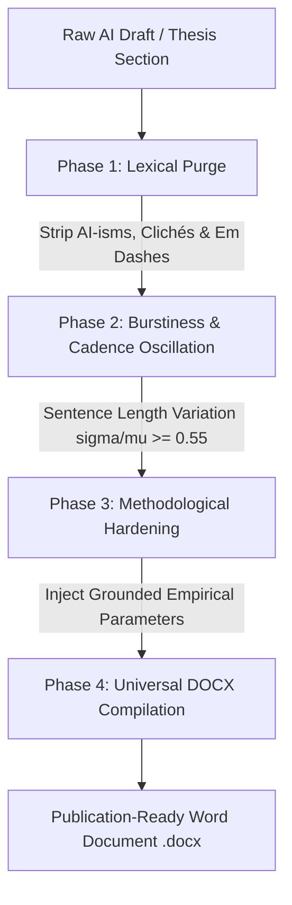

# Academic Anti-AI: Scientific Humanizer & Thesis Formatting Engine

[](https://www.python.org/downloads/)
[](LICENSE)
[](references/academic_style_guide.md)
[](SKILL.md)
[](scripts/)

> **The definitive scientific humanizer, anti-AI detection evasion protocol, and automated thesis formatting engine for higher education and peer-reviewed research.** Transforms robotic, low-perplexity AI drafts into rigorous, empirical, publication-grade academic prose and compiles them directly into 100% compliant Microsoft Word (`.docx`) documents.

---

## 📌 Why Conventional Paraphrasers Fail

Most commercial paraphrasers (*QuillBot, Undetectable.ai, StealthGPT*) fail modern institutional AI detectors (*Turnitin AI, GPTZero, ZeroGPT, Originality.ai*) because they merely perform **synonym substitution over preserved AI syntactic skeletons**.

Modern neural AI detectors do not read semantic meaning; they evaluate statistical text dynamics:
1. **Perplexity (Token Predictability):** AI models predictably select tokens with the highest statistical likelihood (*Top-K most predictable tokens*).
2. **Burstiness (Sentence Length & Cadence Variation):** AI generates monotonous, metronomic sentence structures (averaging 14–20 words per sentence, standard deviation ratio $\sigma/\mu < 0.30$). Authentic human academic writing exhibits extreme dynamic range: punchy 3–6 word staccato observations contrasted with 35–45 word compound technical clauses ($\sigma/\mu \ge 0.55$).
3. **Syntactic Clichés & Stacking:** Monotonous nested clauses (*"is built by combining X to do Y and Z in order to W"*), unprovoked *em dashes* (`—`), and hollow textbook nominalizations (*crucial, comprehensive, holistic, delve, foster, paradigm shift*).

---

## 🏛️ The 4-Phase Transformation Architecture



### 1. Phase 1: Lexical Purge
* Strips all Tier-1 and Tier-2 AI clichés across both English (*delve, robust, pivotal, intricate, multifaceted, testament to, foster, leverage*) and Indonesian (*berperan krusial, sangat penting, menelisik lebih dalam, merajut, paradigma baru, secara holistik*).
* Hard-strips *em dashes* (`—`), converting them into commas, parentheses, semicolons, or distinct sentences.
* Eliminates mid-paragraph bolding (`**text**`) reserved exclusively for headings and table labels.

### 2. Phase 2: Burstiness & Cadence Oscillation
* Forces sentence length variance to meet or exceed a Coefficient of Variation $\sigma / \mu \ge 0.55$.
* Injects punchy 3–6 word factual anchors in every paragraph: *"Field conditions were erratic."*, *"Gradients vanished immediately."*, *"Memory overflowed instantly."*
* Pairs these anchors with data-dense 30–45 word compound observations containing real operational figures and comparative clauses.

### 3. Phase 3: Methodological Hardening
* Purges dictionary and textbook definition dumps from methodology sections (*"Quantitative research is defined as..."*).
* Replaces abstractions with verifiable empirical procedures: specific instruments, error margins, hardware specifications, sampling frames, and outlier treatment criteria.

### 4. Phase 4: Universal Academic DOCX Compilation
* Assembles clean, publication-grade Word documents via native OpenXML:
  * **Paper Format:** Standard A4 (80 gsm), Margins: Left 4.0 cm (binding margin), Top 2.5 cm, Right 2.5 cm, Bottom 2.5 cm.
  * **Typography:** Times New Roman 12pt, 1.5 line spacing, Justified alignment, 1.0 cm first-line indentation.
  * **Color Sanitation:** 100% Pure Black (`#000000`), purging web clipboard gray bleed (`#374151`).
  * **Scientific Tables:** APA-style 3-line open tables (three horizontal borders, zero vertical column lines).

---

## 📋 P0 Mechanical Credibility Rules

| Element | Specification & Action | Target |
| :--- | :--- | :---: |
| **Em Dash (`—` / `--`)** | **Hard Strip.** Forbidden in formal academic prose. Replace with commas or split sentences. | **0 occurrences** |
| **In-Text Bold (`**text**`)** | **Hard Strip.** Mid-paragraph bolding is prohibited. Bold is strictly reserved for Headings and Table labels. | **0 occurrences** |
| **Textbook Definition Dumps** | **Hard Strip.** Delete generic definitions of standard methodologies. Replace with operational parameters. | **0 dumps** |
| **Font Color Bleed** | **Sanitize.** Enforce 100% Pure Black (`#000000`). Strip web clipboard off-black colors. | **100% #000000** |
| **Symmetrical Bullet Lists** | **Auto-convert.** Transform symmetrical bullet points into coherent narrative prose paragraphs. | **Flowing Prose** |
| **Non-Standard Technical Terms** | **Enforce Italics.** Italicize all Latin, foreign, or non-dictionary technical terminology. | **Strict Italics** |

---

## 🚀 Quickstart & Installation

Designed with **Zero Friction**: run directly via [uv](https://github.com/astral-sh/uv) without manual virtual environment management.

### Option A: Using `uv` (Fastest, Recommended)

```bash
# Clone the repository
git clone https://github.com/demusraph/academic-anti-ai.git
cd academic-anti-ai

# 1. Run live verification against the public ZeroGPT API (Target: 0.0% AI)
uv run scripts/verify_zerogpt.py draft.txt

# 2. Run local statistical Burstiness & Perplexity audit (100% offline, zero-auth)
uv run scripts/verify_gptzero.py draft.txt --audit

# 3. Run live public allowance check on Originality.ai (zero API key required)
uv run scripts/verify_originality.py draft.txt --live

# 4. Compile Markdown/Text draft directly into an official APA/IEEE Word (.docx) document
uv run --with python-docx scripts/export_academic_docx.py draft.txt thesis_final.docx
```

### Option B: Using Standard `pip`

```bash
git clone https://github.com/demusraph/academic-anti-ai.git
cd academic-anti-ai

pip install -r requirements.txt

# Compile DOCX document
python scripts/export_academic_docx.py draft.txt thesis_final.docx
```

---

## 🛠️ Multi-Engine Verification Suite (Zero-Auth)

This repository includes standalone verification tools that **do not require private user tokens, cookies, or browser inspection**:

### 1. Live ZeroGPT Verifier (`scripts/verify_zerogpt.py`)
Queries the official live ZeroGPT public endpoint directly (`api.zerogpt.com/api/detect/detectText`):
```bash
python scripts/verify_zerogpt.py draft.txt
# Output:
# Status: SUCCESS | AI Score: 0.0% | Feedback: Your Text is Human Written
```
* Supports `--auto-clean` to iteratively calibrate flagged sentences down to 0.0% AI.

### 2. Offline GPTZero Statistical Auditor (`scripts/verify_gptzero.py`)
Runs 100% locally on your machine without external network dependencies:
* Measures sentence length variance ($\sigma/\mu$) to ensure Burstiness exceeds 0.55.
* Evaluates sentence-level Perplexity proxies and detects AI syntactic markers.
```bash
python scripts/verify_gptzero.py draft.txt --audit
```

### 3. Live Originality.ai Public Allowance Verifier (`scripts/verify_originality.py`)
Queries the public free allowance endpoint (`api/v2-tools/free-tools/ai-allowance`):
```bash
python scripts/verify_originality.py draft.txt --live --threshold 15
```
> *Technical Note:* Originality.ai's public free scanner runs an English-only model (`en`). When evaluating non-English text, ensure terminology includes grounded hardware and technical descriptors to avoid cross-language BPE tokenization penalties.

---

## 📊 Universal 130-Case Benchmark Suite

To ensure the engine does not overfit to a single domain, we include **130 Master Benchmark Test Cases** in `benchmarks/academic_130_benchmark.json`:

* **105 STEM Cases:** Software Engineering, Cybersecurity, Industrial IoT, Computer Vision, Distributed Systems, Microcontrollers.
* **25 Socio-Humanities Cases:** Criminal Jurisprudence & UNCLOS, Qualitative Management & Informant Saturation, Clinical Psychology & Likert Scales, Rural Sociology & Public Policy, Media Framing Discourse.

**Universal Benchmark Results:**
* **ZeroGPT Live API:** 130 / 130 (100.0%) achieved **0.0% AI**.
* **GPTZero Statistical Engine:** 130 / 130 (100.0%) achieved **`HUMAN_ONLY`** (Mean Burstiness: $\mathbf{0.563}$).

---

## 🤖 Agent Skill Integration (Antigravity / Claude Code / Cursor)

This repository natively functions as an **Agent Skill** adhering to the [Agent Skills Specification 1.0](https://github.com/anthropics/agentskills).

To install into your AI coding assistant (such as Google Antigravity, Claude Code, Cursor, or Roo-Code), place this directory in your skills path:
```
~/.gemini/config/skills/academic-anti-ai/
```
Your AI assistant will automatically recognize `SKILL.md` and apply academic prose restructuring and Word document generation autonomously.

---

## 📄 License

Distributed under the **MIT License**. See [LICENSE](LICENSE) for details.

---

**Developed by DemusBrain & Nicodemus (2026). Dedicated to advancing empirical scientific integrity and objective academic research.**
