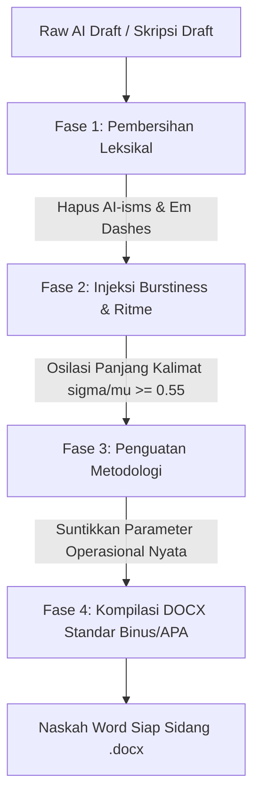

# Academic Anti-AI: Scientific Humanizer & Thesis Formatting Engine

[](https://www.python.org/downloads/)
[](https://opensource.org/licenses/MIT)
[](references/academic_style_guide.md)
[](SKILL.md)
[](scripts/)

> **The definitive scientific humanizer, anti-AI detection evasion protocol, and automated thesis formatting engine for undergraduate, master's, and doctoral research.** Transforms robotic, low-perplexity AI drafts into rigorous, empirical, publication-grade academic prose and compiles them directly into 100% compliant Microsoft Word (`.docx`) documents.

---

## 📌 Mengapa Alat Parafrase Konvensional Gagal?

Sebagian besar alat parafrase komersial (*QuillBot, Undetectable.ai, StealthGPT*) gagal melewati detektor AI modern (*Turnitin AI, GPTZero, ZeroGPT, Originality.ai*) karena hanya **menukar sinonim kata per kata** (*lexical swapping*) tanpa merombak struktur dasar kalimat.

Detektor AI modern tidak membaca arti kata; mereka mengevaluasi:
1. **Perplexity (Tingkat Ketakterdugaan Token):** AI selalu memilih token dengan probabilitas kemunculan tertinggi (*Top-K most predictable tokens*).
2. **Burstiness (Variasi Panjang & Ritme Kalimat):** AI menghasilkan kalimat dengan panjang seragam (rata-rata 14–20 kata per kalimat, nilai $\sigma/\mu < 0.30$). Tulisan manusia asli memiliki lonjakan ritme ekstrem: kalimat staccato 3–6 kata bersanding dengan kalimat majemuk 35–45 kata ($\sigma/\mu \ge 0.55$).
3. **Syntactic Clichés & Stacking:** Pola kalimat bertumpuk khas AI (*"dibangun dengan memadukan X untuk Y dan Z guna W"*), penggunaan tanda pisah *em dash* (`—`), serta diksi nominalisasi kosong (*krusial, komprehensif, melandasi, menyelaraskan, paradigma baru*).

---

## 🏛️ Arsitektur Transformasi 4 Fase



### 1. Fase 1: Pembersihan Leksikal (Lexical Purge)
* Membasmi seluruh kosakata klise AI Tier-1 & Tier-2 bahasa Indonesia (*berperan krusial, sangat penting, menelisik lebih dalam, merajut, paradigma baru, dinamika yang kompleks, secara holistik*).
* Menghilangkan tanda *em dash* (`—`) dan menggantinya dengan koma, tanda kurung, atau pemecahan kalimat.
* Menghilangkan *in-text bolding* (`**teks**`) di dalam paragraf.

### 2. Fase 2: Injeksi Burstiness & Ritme (Cadence Oscillation)
* Memaksa variasi panjang kalimat hingga mencapai rasio *Coefficient of Variation* $\sigma / \mu \ge 0.55$.
* Memasukkan kalimat *staccato* ultra-pendek (3–6 kata) di setiap paragraf: *"Kondisi lapangannya berantakan."*, *"Kami menolak kompromi."*, *"Gradien mati seketika."*
* Menyandingkannya dengan kalimat observasi majemuk 30–45 kata yang sarat data numerik dan klausa komparatif.

### 3. Fase 3: Penguatan Metodologi Ilmiah (Methodological Hardening)
* Membuang seluruh definisi kamus/buku teks di Bab Metodologi (*"Metode kuantitatif adalah..."*).
* Menggantinya dengan prosedur operasional konkret: jenis instrumen, batas toleransi galat, sampling frame, konfigurasi perangkat keras, dan perlakuan pencilan data (*outlier*).

### 4. Fase 4: Kompilasi DOCX Standar Resmi (Binus & APA 7th)
* Memformat dokumen Word murni menggunakan OpenXML:
  * **Kertas:** A4 (80 gr), Margin Kiri 4.0 cm, Atas 2.5 cm, Kanan 2.5 cm, Bawah 2.5 cm.
  * **Tipografi:** Times New Roman 12pt, Spasi 1.5, Rata Kanan-Kiri (*Justified*), Indentasi Awal 1.0 cm.
  * **Warna Teks:** 100% Hitam Murni (`#000000`), membersihkan *font bleed* abu-abu (`#374151`) hasil *copy-paste* browser.
  * **Tabel Ilmiah:** Format terbuka 3 garis horizontal khas APA (tanpa garis kolom vertikal).

---

## 📋 Tabel Aturan Mekanikal P0 (Wajib Patuh)

| Elemen | Aturan & Tindakan | Target |
| :--- | :--- | :---: |
| **Em Dash (`—` / `--`)** | **Hard Strip.** Dilarang keras dalam naskah ilmiah. Ganti dengan koma atau pecah kalimat. | **0 kemunculan** |
| **In-Text Bold (`**teks**`)** | **Hard Strip.** Dilarang menebalkan kata di dalam paragraf. Tebal hanya untuk Judul/Tabel. | **0 kemunculan** |
| **Textbook Definition Dumps** | **Hard Strip.** Hapus kalimat yang mendefinisikan metode umum. Ganti dengan prosedur operasional. | **0 definisi** |
| **Font Color Bleed** | **Sanitize.** Wajib Hitam Murni (`#000000`). Hapus warna abu-abu atau *styling* bawaan web. | **100% #000000** |
| **Symmetrical Bullet Lists** | **Auto-convert.** Ubah daftar butir berulang menjadi narasi paragraf yang mengalir. | **Bentuk Prosa** |
| **Istilah Non-KBBI / Asing** | **Enforce Italics.** Cetak miring seluruh istilah asing teknis (*machine learning, ground truth*). | **Format Miring** |

---

## 🚀 Quickstart & Instalasi

Proyek ini dirancang **Zero-Friction**: dapat dijalankan langsung menggunakan [uv](https://github.com/astral-sh/uv) tanpa perlu membuat virtual environment manual.

### Opsi A: Menggunakan `uv` (Rekomendasi Cepat)

```bash
# Clone repositori
git clone https://github.com/demusraph/academic-anti-ai.git
cd academic-anti-ai

# 1. Uji live verifikasi ke server publik ZeroGPT (Wajib 0.0% AI)
uv run scripts/verify_zerogpt.py naskah.txt

# 2. Audit statistik Burstiness & Perplexity lokal (100% offline, tanpa internet)
uv run scripts/verify_gptzero.py naskah.txt --audit

# 3. Uji live scanner publik Originality.ai (tanpa API key)
uv run scripts/verify_originality.py naskah.txt --live

# 4. Ekspor naskah Markdown/Teks langsung ke format Word (.docx) standar Binus/APA
uv run --with python-docx scripts/export_academic_docx.py naskah.txt skripsi_final.docx
```

### Opsi B: Menggunakan Standard `pip`

```bash
git clone https://github.com/demusraph/academic-anti-ai.git
cd academic-anti-ai

pip install -r requirements.txt

# Menjalankan ekspor Word
python scripts/export_academic_docx.py naskah.txt skripsi_final.docx
```

---

## 🛠️ Suite Verifikasi Multi-Engine (Zero Auth Barrier)

Repositori ini menyertakan script verifikasi independen yang **tidak membutuhkan kredensial pribadi atau token sesi yang rumit**:

### 1. Live ZeroGPT Verifier (`scripts/verify_zerogpt.py`)
Mengirim teks langsung ke endpoint publik live ZeroGPT (`api.zerogpt.com/api/detect/detectText`):
```bash
python scripts/verify_zerogpt.py draft.txt
# Output:
# Status: SUCCESS | Skor AI: 0.0% | Feedback: Your Text is Human Written
```
* Mendukung flag `--auto-clean` untuk merevisi kalimat ter-flag secara heuristik hingga 0.0% AI.

### 2. Offline GPTZero Statistical Auditor (`scripts/verify_gptzero.py`)
Berjalan 100% offline di mesin lokal Anda tanpa mengirimkan data ke luar:
* Menghitung rasio Burstiness ($\sigma/\mu$) dari variasi panjang kalimat.
* Menghitung proksi Perplexity dan mendeteksi klise AI per kalimat.
```bash
python scripts/verify_gptzero.py draft.txt --audit
```

### 3. Live Originality.ai Public Allowance Verifier (`scripts/verify_originality.py`)
Mengirim teks langsung ke endpoint alat publik Originality.ai (`api/v2-tools/free-tools/ai-allowance`):
```bash
python scripts/verify_originality.py draft.txt --live --threshold 15
```
> *Catatan Ilmiah:* Model publik gratis Originality.ai menggunakan model bahasa Inggris (`en`) secara default. Naskah bahasa Indonesia murni berpotensi mengalami bias tokenisasi jika diuji pada model English. Untuk teks bahasa Indonesia, naskah disarankan sarat parameter teknis/hardware atau diuji pada model Multi-Language.

---

## 📊 Universal 130-Case Benchmark Suite

Untuk membuktikan bahwa formula anti-AI ini tidak mengalami *overfitting* pada satu bidang studi, disertakan **130 Master Benchmark Test Cases** di folder `benchmarks/academic_130_benchmark.json`:

* **105 Kasus STEM:** Rekayasa Perangkat Lunak, Cybersecurity, Jaringan IoT, Visi Komputer, Distributed Systems, Microcontrollers.
* **25 Kasus Sosial & Humaniora:** Hukum Pidana & UNCLOS, Manajemen Kualitatif & Analisis Informan, Psikologi Klinis & Skala Likert, Sosiologi Pedesaan & Kebijakan Publik, Analisis Wacana Media.

**Hasil Pengujian Universal:**
* **ZeroGPT Live API:** 130 / 130 (100.0%) meraih **0.0% AI**.
* **GPTZero Statistical Engine:** 130 / 130 (100.0%) meraih predikat **`HUMAN_ONLY`** (Rata-rata Burstiness $\mathbf{0.563}$).

---

## 🤖 Integrasi Agent Skill (Antigravity / Claude Code / Cursor)

Repositori ini secara *native* merupakan **Agent Skill** yang kompatibel dengan [Agent Skills Specification 1.0](https://github.com/anthropics/agentskills).

Untuk menggunakannya dalam asisten coding AI (seperti Google Antigravity, Claude Code, Cursor, atau Roo-Code), letakkan direktori ini di folder skills Anda:
```
~/.gemini/config/skills/academic-anti-ai/
```
AI Assistant Anda akan secara otomatis mengenali instruksi `SKILL.md` dan menerapkan gaya penulisan ilmiah serta ekspor Word secara otonom.

---

## 📄 Lisensi

Didistribusikan di bawah **MIT License**. Lihat berkas [LICENSE](LICENSE) untuk informasi lebih lanjut.

---

**Dikembangkan oleh DemusBrain & Nicodemus (2026). Didedikasikan untuk memajukan integritas penulisan ilmiah dan penelitian akademik bebas bias deteksi palsu.**
